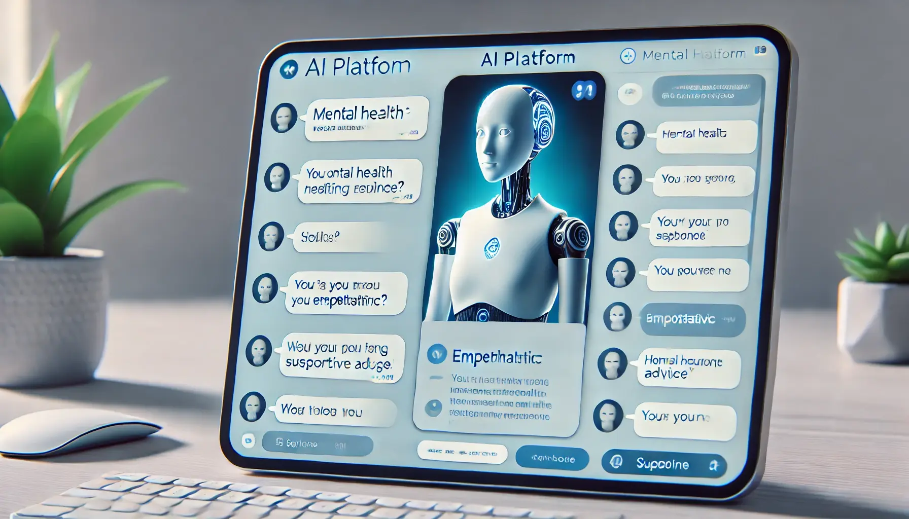
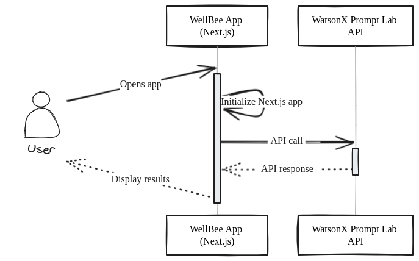
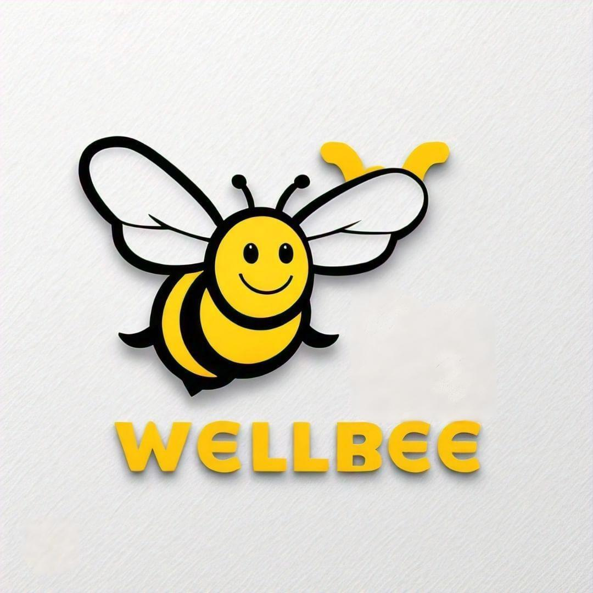
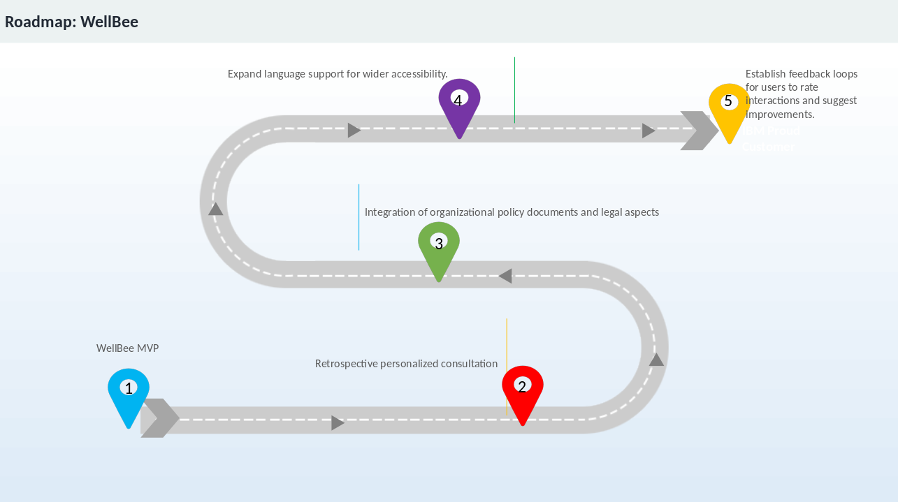

# WellBee  

- [Project summary](#project-summary)  
  - [The issue we are hoping to solve](#the-issue-we-are-hoping-to-solve)  
  - [How our technology solution can help](#how-our-technology-solution-can-help)  
  - [Our idea](#our-idea)  
- [Technology implementation](#technology-implementation)  
  - [IBM AI service(s) used](#ibm-ai-services-used)  
  - [Other IBM technology used](#other-ibm-technology-used)  
  - [Solution architecture](#solution-architecture)  
- [Presentation materials](#presentation-materials)  
  - [Solution demo video](#solution-demo-video)  
  - [Project development roadmap](#project-development-roadmap)  
- [Additional details](#additional-details)  
  - [How to run the project](#how-to-run-the-project)  
  - [Live demo](#live-demo)  
- [About this template](#about-this-template)  
  - [Contributing](#contributing)  
  - [Versioning](#versioning)  
  - [Authors](#authors)  
  - [License](#license)  
  - [Acknowledgments](#acknowledgments)  

## Project summary  

### The issue we are hoping to solve  

Mental health is a critical yet often overlooked aspect of overall well-being. Workplace stress affects over 80% of employees, with 1 in 5 experiencing mental health challenges annually. Stigma and lack of access to personalized mental health resources further exacerbate the problem, leading to lower productivity, higher absenteeism, and employee turnover. Current solutions fail to address individual needs, preventing employees from receiving effective support. 

   

## How our technology solution can help  

# Introducing **WellBee**
A safe, anonymous platform powered by IBM WatsonX Prompt Lab. WellBee offers personalized mental health strategies, coping mechanisms, and access to certified counselors to employees without fear of exposure or judgment.  

## Our idea  

WellBee leverages AI to foster well-being and improve workplace productivity through:  
- Anonymous, secure interactions to encourage help-seeking behavior.  
- Personalized recommendations based on natural language inputs and contextual analysis.  
- Continuous learning from user interactions to offer better, more targeted advice over time.

  

By addressing mental health with empathy and precision, WellBee aims to reduce workplace stress by 40% and increase productivity by up to 20%.  

---

## Technology implementation  

### IBM AI service(s) used  

- **[IBM WatsonX.ai Prompt Lab](https://www.ibm.com/docs/en/watsonx/saas?topic=solutions-prompt-lab)**  **under [IBM WatsonX.ai](https://www.ibm.com/watsonx)**:  
   - Uses Natural Language Processing (NLP) to analyze user input and generate tailored responses.  
   - Continuously learns from interactions to improve advice and recommendations.  

### Other IBM technology used  

- **[IBM Cloud](https://www.ibm.com/cloud)**:  
  - Ensures scalability and secure access across global teams.  
  - Supports integration with certified mental health professionals and resources.  

 

### Solution architecture  

  

1. Employees access the platform via a secure, anonymous interface.  
2. User input is analyzed using WatsonX NLP to offer personalized recommendations.  
3. The platform provides exercises, coping strategies, and access to counselors if needed.  
4. IBM Cloud ensures seamless deployment and data privacy compliance.  

---

## Presentation materials  

### Solution demo video  

### Project development roadmap  

Current features include:  
- Anonymous access for employees to seek mental health support.  
- Personalized advice and strategies using AI-powered analysis.  
- Continuous learning for more effective recommendations over time.  
- Access to certified counselors for additional help.  

#### Future additions:  
- Integration with wellness tracking tools for more holistic support.  
- Analytics for employers to identify trends while ensuring anonymity.  
- Localization to meet cultural needs across global teams.  

  

---

## Additional details  

### How to run the project  

1. **Create API Key:**  
   Follow [these steps](https://cloud.ibm.com/docs/account?topic=account-userapikey&interface=ui#create_user_key) to create API key from your IBM Cloud Account.

2. **Frontend Deployment:**  
   Follow the [React Frontend Setup Guide](Frontend/README.md).  

3. **IBM WatsonX Prompt Lab:**  
   Follow [these steps](https://www.ibm.com/docs/en/watsonx) to create a Prompt Lab instance and connect it to your application.  

4. **Data Privacy Compliance:**  
   Ensure your organization follows applicable privacy laws such as GDPR and CCPA when deploying this solution.  

### Live Demo  

Here is the link to the live demo - [WellBee](https://wellbeeai.netlify.app/)

---
## About this template

### Contributing

Please read [CONTRIBUTING.md](CONTRIBUTING.md) for details on our code of conduct, and the process for submitting pull requests to us.

### Versioning

We use [SemVer](http://semver.org/) for versioning. For the versions available, see the [tags on this repository](https://github.com/your/project/tags).

### Authors  

  

---

### License  

This project is licensed under the Apache 2 License - see the [LICENSE](LICENSE) file for details.  

---

### Acknowledgments  

We thank IBM for providing access to WatsonX and Prompt Lab technologies, enabling us to build this solution.  
Special thanks to mental health professionals for their guidance and insights during development.  

---

Join us in redefining workplace mental health—eliminating stigma, providing personalized care, and building healthier work environments.
